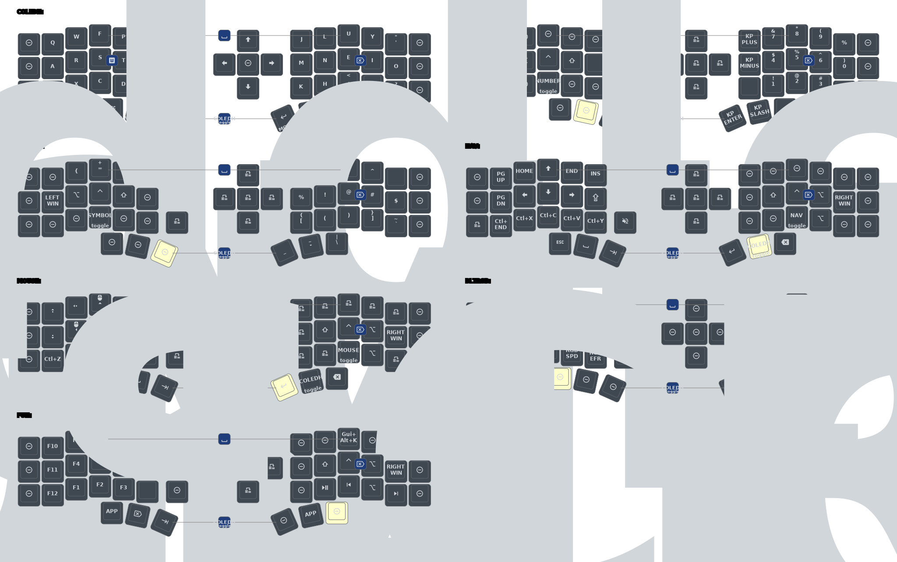

## Corne consolidated keymap

[Manual Keymap](https://www.keyboard-layout-editor.com/#/gists/2dfccb10efb1b1b25d5ebd17b6acdc26)
[English](README_EN.md)

# Customising Corne

## Base Layer
Customising a base layer to hadle some basic needs

1. I replaced QWERTY with a faster layout—Colemak DH—but made a slight adjustment to the placement of the ', /, ; characters. This change was to make the accent giver (;:) key more accessible for my right pinky, as almost every Greek word requires accents. This small tweak significantly improves typing efficiency in Greek.

2. Switching between my main languages (English/Greek) is seamless. I’ve set up an on-tap behavior on the middle left thumb key that triggers Win+Space (the language switcher in Windows). This allows me to effortlessly switch languages mid-sentence without losing speed, even in complex cases like:

"Το Project Plan μας αποτελείται από 4 sprints των 3 εβδομάδων."

This setup makes multilingual typing smooth and natural.

3. I’ve made it easy to input even the most complex keyboard shortcuts by using a custom behavior with altered home row modifiers on my fingers' rest positions. This setup uses tap-preferred logic to prevent accidental triggering, ensuring accuracy.

While this approach makes initiating combos slightly slower, it’s an acceptable trade-off for me, as it offers reliability and minimizes mistakes.

Most common keyboard shortcuts used
* win+arrow (from the joystick) to move app windows around
* win+number to activate the equivalent pinned item of windows taskbar
* win+shift+number to open a new session -//- 
* win+L to lock in windows
* win+r to run cmd etc
* win+i to access windows settings and connect to my wireless headset if not immediately connected (i find it faster than win+k that is searching devices)
* win+e to open file explorer
* win+shift+tilde(`) to access the windows power toys app zones editor
* win+alt+k as a combo stored in rotary encoder click to easy toggle mic mute accross system (yes overrides teams mute also) super handy
* ctr+t new tab in browsers, file explorer, format as table in excel
* ctr+n new window, new folder
* ctr+shift+r to hard refresh tab
* ctr+1 to open options in excel
* ctr+w to quit
* ctr+f to find
* ctr+L to access the address bar (combo this with win+number makes me super fast in opening new tabs or copying url to provide to another app)
* ctr+backspace to delete word by word (backspace is combo of n,e)
* ctr+tilde to reveal formulas in excel
* alt+arrow to navigate in file explorer 

Why is there a dedicated Alt button when I already have Alt in my home row mods?

The reason is that home row mods require holding down a key, which takes a bit of time. This can be inconvenient, especially in Excel, where pressing and releasing the Alt key gives you quick access to the ribbon, allowing you to navigate and select items by typing a series of keys.

While I can trigger these actions in Excel using the / key, in Windows, pressing Alt along with the underlined key in a menu provides keyboard access to any item in the context menu.

Having a sticky Shift or a Caps dual-tap/tap mod on the right-hand thumb cluster is incredibly useful for capitalizing the first letter of each word with a single tap. This setup not only reduces the strain of holding down the Shift key but also improves typing speed, especially when punctuation is involved, as it seamlessly integrates into the typing flow.

Double-tapping activates Caps Lock, which is also accessible through a two-key combo (C+D). While I'm still deciding which setup I prefer, I currently have both options available. Additionally, there's a Caps Word behavior mapped to the S+T combo, which is handy for typing in all caps briefly.

Initially, I was concerned about accidentally triggering Ctrl+Shift, but I was relieved to find that this issue didn’t occur.

I used to have Backspace and Delete on my thumb cluster, but now I’ve moved them to two-key combos on the home row: N+E for Backspace and E+I for Delete. This setup is extremely convenient and makes deleting word by word with Ctrl+N+E insanely fast.

On the right thumb cluster, I’ve added Smart Num functionality. It provides num_word (numbers on tap) and mo (access to the num layer) on hold.

I also introduced a custom behavior called sl_mo, which offers a sticky layer on tap and a momentary layer (mo) on hold. I use this on the right-hand cluster to type a single symbol with a tap or access a full symbol layer when held.

I’m considering designing a Smart Sym logic similar to Smart Num, but for now, I don’t encounter frequent cases of typing a series of symbols, except for double brackets or Markdown headers with hashtags.

## Number Layer
## Symbol Layer
## Navigation Layer
## Bluetooth & RGB Layer
## Function Layer
## Minecraft & Numpad Layer

## Corne keymap by layer

